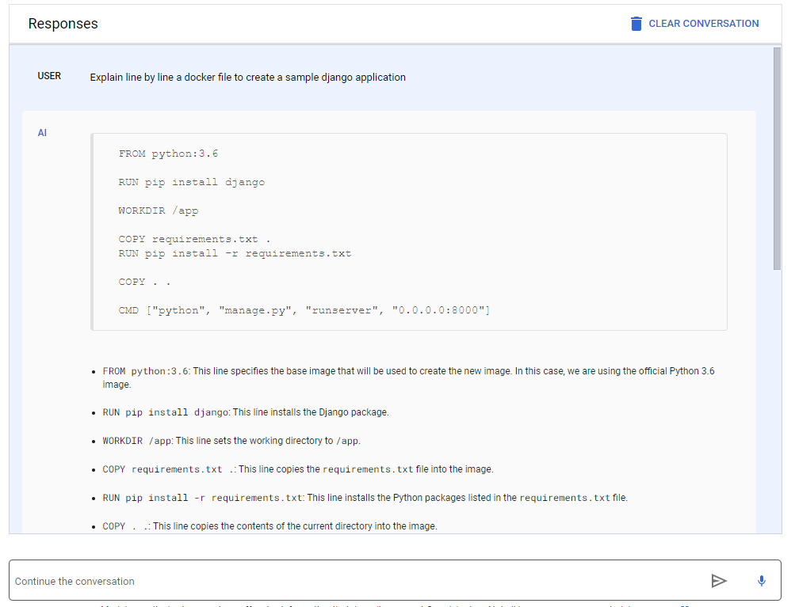

# Chat Models
- Assume a character
- Identify Topics to focus on
- Specify response style
- Provide specific rules.

  we can ask questions to write a small piece of code for example "Write a docker file for hosting nginx application"

